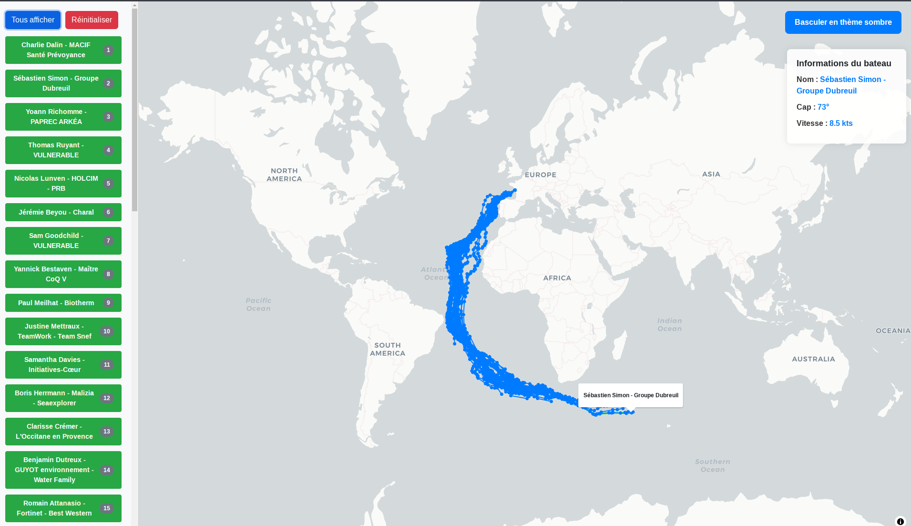

# 🌍 Vendée Globe 2024 ⛵

Ce projet propose des **scripts Python** permettant de construire des données géographiques à partir des pointages du **Vendée Globe 2024**, fournis toutes les 4 heures sur le [site officiel](https://www.vendeeglobe.org/classement) de la compétition.

Grâce à ce projet, vous pouvez visualiser les **dernières positions des skippers** dans votre SIG préféré comme [QGIS](https://qgis.org/). 🗺️


## 🗺️ Visualiseur Web Cartographique

Un visualisateur web permet de visualiser les données qui sont release par la CI (voir ci-dessous). Celui est utilise [Maplibre](https://maplibre.org/), il est déployé par la CI dans les Github Pages à cette [url](https://florentfgrs.github.io/Vendee-Globe-2024/).

> [!IMPORTANT]  
> Je suis moins familié avec le JavaScript, je me suis donc aidé de ChatGPT pour écrire ce code.



## Produire les données

### 🛠️ Environnement Virtuel

Pour installer les dépendances dans un environnement virtuel (venv), voici la procédure recommandée :

```bash
python -m venv .venv
source .venv/bin/activate   # Sur Windows, utilisez `.venv\Scriptsctivate`
pip install -r requirements.txt
```

Cela vous permettra de garder votre environnement propre et de gérer facilement les bibliothèques nécessaires au projet. 🌱

### 📡 Obtenir le dernier pointage en Date au Format GPKG

Pour récupérer le **dernier pointage** et le sauvegarder en **GPKG**, utilisez la commande suivante :

```bash
python dernier_pointage.py --output-dir ./data_output/
```

Cela vous permettra d'avoir le dernier pointage mis à jour dans votre répertoire de sortie. 📍

### 📜 Télécharger l'historique complet des pointages

Si vous souhaitez télécharger **tous les pointages historiques**, exécutez :

```bash
python trajectoires_pointages.py --output-dir ./data_output/
```

Cela vous fournira un fichier contenant l'ensemble des trajets et positions des skippers. 🛳️

## 📅 Release

Chaque jour à **3h30, 7h30, 11h30, 15h30, 19h30 et 23h30**, un processus **CI/CD** exécute le script `trajectoires_pointages.py` pour :

1. Mettre à jour les fichiers **GeoJSON** (`pointages.geojson` et `trajectoire.geojson`) directement dans le dossier `data/` du dépôt.
2. Publier un nouveau fichier **Geopackage** dans la section des [Latest Daily Release](https://github.com/florentfgrs/Vendee-Globe-2024/releases/tag/latest).

### 📂 Fichiers disponibles

- **GeoJSON** :
  - [Pointages](https://github.com/florentfgrs/Vendee-Globe-2024/blob/main/data/pointages.geojson)
  - [Trajectoires](https://github.com/florentfgrs/Vendee-Globe-2024/blob/main/data/trajectoire.geojson)
- **Geopackage** :
  - [Derniers Données du Jour](https://github.com/florentfgrs/Vendee-Globe-2024/releases/download/latest/latest_data.gpkg) 🚀

## 🚀 Développement

Dans ce projet, les **pre-commit** sont utilisés. Pour mettre en place votre environnement de développement, il faut donc effectuer les opérations suivantes (dans votre `venv`) :

```shell
pip install pre-commit
pre-commit install
```

## 📜 Licence

Ce projet est sous licence MIT - voir le fichier [LICENSE](./LICENSE) pour plus de détails.
